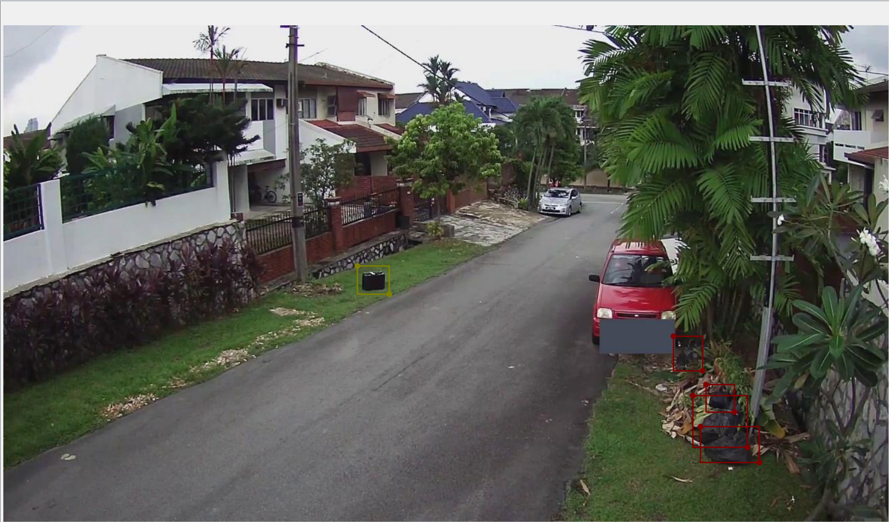

# 소개
- yolov7과 미리 학습된 가중치를 이용하여 탐지된 객체의 정보를 labelme형식의 JSON으로 내보내주는 도구입니다

## 사용법
- detectandretJson.py을 이용하여 진행
- Example : python detectandJson.py --weights yolov7.pt --conf 0.25 --img-size 640 --source inference/images/horses.jpg

## 알림
- 학습된 가중치 파일은 https://github.com/WongKinYiu/yolov7에서 찾아볼 수 있습니다

## 실사용된 모습

